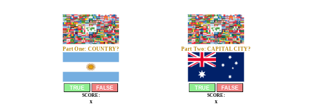

# Flag game

Flag game is a game created using html, css and javaScript. Upon pressing the start button you have two parts to the game to complete it and receive your final score. Part one consists of 5 questions one after the other where the a random country and a random flag appear and the user is required to choose true or false in order to go to the next question.
Part two is very similar but instead of a country as an option the capital city of the country is required. Upon the user answering 5 questions of each part his/her final score appears along with a play again button.

## Features

### Existing Features

- __The header__

 - The header contains the title of the game.
 - A short description of the game.
 - A start button that initiates the starting of the game.

 

- __The Game Area__

 - This section will allow the user to test his knowledge of national flags.
 - In part one the user is required consecutively compare from the flag and country that appears and choose true or false.
 - In part two the flag appears with a capital city and the user again must choose true or false.
 - There is a total of 5 questions on each part for the completion of the game.
 - The individual scores appear at the time separately for both games under the flags.

  

 - __The Final Score Area__

 - This area appears upon the completion of both parts of the game.
 - It consists of the total score of the two games.
 - A play again button which restarts the game.
 - This section disappears again upon the game restarting.

 

 - __The Footer__

 - This area is also the final score area.
 - Initially when the game loads however and before the start button is pressed it consists of a title that shows that this is where the final score will be displayed along with instructions on how many answers are required to acheive the final score.

 

 
